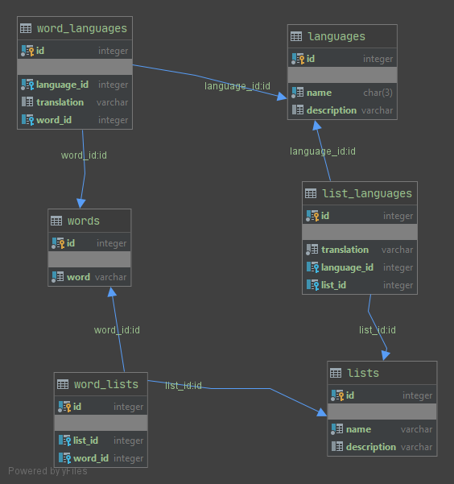

# WordList service
API Rest sobre una pequeña parte de los servicios de WordList

    - Crear una nueva palabra
    - Crear una nueva lista
    - Consulta una lista filtrando por idioma e identificador de lista.
    - Consulta de una palabra filtrando por idioma e identificador de palabra.   
         
#Instalación Postgres
Para realizar pruebas en desarrollo debemos crear una instancia (Utilizo el puerto 5433 para evitar colisión con una instancia previa existente):

-- Crear imagen Postgres
docker pull postgres:12-alpine

-- Arrancar Postgres
docker run -p 5433:5432 --name postgres12-wordlist -e POSTGRES_DB=wordlist -e POSTGRES_USER=postgres  -e POSTGRES_PASSWORD=postgres -d postgres:12-alpine

--Ver logs de arranque
docker logs postgres12-wordlist

#Creación de la Base de Datos

En el directorio sql adjunto un fichero DataBase.sql.  
Este fichero se debe ejecutar antes de iniciar las pruebas del servicio REST.  
El fichero crea el esquema, tablas, relaciones, índices y por último realiza una carga de los datos de ejemplo.  

#Diagram del modelo de datos propuesto

#Ejemplos invocación de los servicios

Una vez arrancado el servicio de Node.js, podemos testear los diferentes endpoints.  

* Crear una nueva palabra:  
`curl --location --request POST 'http://localhost:3001/api/v1/word' \
 --header 'Content-Type: application/json' \
 --data-raw '{"word":"w35"}'`

* Crear una nueva lista:  
`curl --location --request POST 'http://localhost:3001/api/v1/list' \
 --header 'Content-Type: application/json' \
 --data-raw '{"name":"lista de ejemplo","description":"descripción de ejemplo opcional"}'`

* Consulta una lista filtrando por idioma e identificador de lista:  
`curl --location --request GET 'http://localhost:3001/api/v1/word-list?languageId=2&listId=1'`

* Consulta de una palabra filtrando por idioma e identificador de palabra:  
`curl --location --request GET 'http://localhost:3001/api/v1/word?languageId=2&wordId=4'`

#AWS preguntas 

*¿Usarias una instancia? ¿De que tipo?*

No sería necesario utilizar una instancia EC2, si utilizasemos funciones Lambda de AWS.  

La pregunta es, si compensa económicamente esta solución, para ello habría que tomar en cuenta 
varias cuestiones como son el número de llamadas además del tiempo medio de proceso de las mismas.

Si utilizasemos instancias EC2, para el servicio API REST y éste servicio es lo suficientemente
ligero, yo me decantaría por la instancia más pequeña posible pero que mantenga una velocidad de red suficiente. Por ejemplo:

t2.micro con un sólo núcleo, un giga de memoria y red baja a o moderado. 

t2.nano no sería recomendable por su bajo rendimiento de red.

Evidentemente al ser instancias tan pequeñas pueden quedarse sin recursos y habría que crear una
política de autoescalado para aprovisionar nuevas instancias o parar instancias según el tráfico.  

Para ello sería imprescindible contar con un balanceador de carga (ELB) que permita ejecutar las 
reglas de escalado de las instancias.

La principal razón de elegir instancias pequeñas, es que este tamaño permite una granularidad más
fina de autoescalado, que en el caso de instancias grandes. 

Si la aplicación tiene un tráfico mínimo sostenido, se pueden aprovisionar un número mínimo de 
instancias adelantando la compra por 1 o dos años, con lo que el coste puede reducirse un poco
más.

________________________________________
  
*¿Que servicio usarías para subir la BD?*  

Para la Base de datos tenemo la opción más directa que sería usar RDS para PostgreSql.

Este servicio ofrece una gran comodidad de cara a la administración.

Se puede evaluar, no obstante, montar la BBDD en una instancia EC2 dedicada si compensase 
a nivel económico el coste de funcionamiento, inclusive ver el coste de un servidor dedicado
fuera de AWS si compensase su potencia y precio (teniendo en cuenta el coste que AWS realiza
sobre las comunicaciones fuera de su plataforma).

________________________________________

*¿Como añadirías integración continua?*

A través de un repositorio de código como GitLab, se puede configurar un Pipeline que realice 
los tests sobre las nuevas versiones de la aplicación. Si el resultado es satisfactorio subir
la nueva versión a un bucket S3. Los servicios al estar levantados con un gestor de arranque 
como Nodemon pueden ver el cambio en el bucket y hacer un reinicio automático con el código 
de la última versión.  

